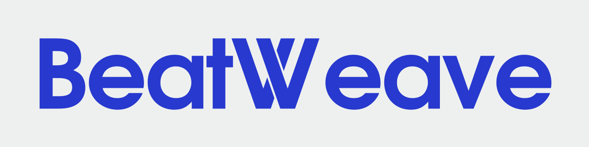

# BeatWeave

Offline music analysis and pitch-preserving beat matching for Kotlin applications.
BeatWeave estimates beats, bars, tempo and key, then uses the observed beat clocks
to plan transitions or simultaneous overlaps. Applications provide audio decoding,
playback and UI.

Version **0.10.0 is a development release**. Automatic bar selection still accepts
some incorrect interpretations and rejects some usable transitions. See
[accuracy and limitations](docs/accuracy.md) before using it for unattended automix.

## Modules

| Module | Purpose | License |
| --- | --- | --- |
| `analysis` | Spectral features, tempo/key estimates, beat clocks and mixing interfaces | MIT |
| `learned-beats` | Local Beat This! inference, bar tracking and transition selection | MIT |
| `rubberband` | Continuous stereo time stretching with unchanged pitch | GPL-2.0-or-later |

The supplied adapters support Android API 26+ and Linux x86_64/JVM. Android native
builds cover arm64-v8a, armeabi-v7a and x86_64. Common iOS targets are optional
(`-PenableAppleTargets=true`); iOS inference and time-stretch adapters are not included.

## Getting started

Follow [the build instructions](docs/build.md) to install the toolchain, build the
native libraries and publish the modules to the local `dist/maven` repository.
Model files are separate; [model setup](docs/models.md) explains how to install
and verify them. No model or audio is downloaded during analysis.

After publishing locally, add the repository to your application's Gradle build:

```kotlin
repositories {
    maven { url = uri("/absolute/path/to/BeatWeave/dist/maven") }
    mavenCentral()
}

dependencies {
    implementation("io.github.adrielggmotion.beatweave:analysis:0.10.0")
    implementation("io.github.adrielggmotion.beatweave:learned-beats:0.10.0")
    implementation("io.github.adrielggmotion.beatweave:rubberband:0.10.0")
}
```

These coordinates refer to artifacts you build locally. Version 0.10.0 has not
yet been published to Maven Central. [Publishing](docs/publishing.md) covers
signing and the manually approved Central release process. The configured Maven
group is `io.github.adrielggmotion.beatweave`.

The Android AAR includes its native libraries. The JVM JAR includes the Linux
x86_64 (glibc) native library; consumers do not need CMake or `java.library.path`.
Model files remain separate. KMP applications can use `analysis` from
`commonMain` and the supplied inference/stretch adapters from Android and JVM
source sets.

```kotlin
val transition = LocalMixPlanner.autoTransition(firstAnalysis, secondAnalysis, bars = 16)
val overlap = LocalMixPlanner.overlap(firstAnalysis, secondAnalysis)
```

Transitions support 2, 4, 8, 16 or 32 bars, with automatic or explicit cue selection.
An overlap retains both recordings and matches their selected common span.
Preparation uses a continuous stretcher; playback, seeking and export reuse its
prepared audio. See [usage](docs/usage.md) for analysis, rendering and error handling.

`examples/jvm` and `examples/android` are integration smoke consumers. They are
not music-player or transition-editor apps.

## Contributing

See [CONTRIBUTING.md](CONTRIBUTING.md) for focused checks and regression reports.

## License

The analysis and learned-beat modules use the [MIT license](LICENSE). Model and
runtime notices are in [learned-beats/licenses](learned-beats/licenses).
The optional Rubber Band module uses [GPL-2.0-or-later](rubberband/COPYING);
its source and attribution are described in [THIRD_PARTY.md](rubberband/THIRD_PARTY.md).
Including that module does not produce an MIT-only distribution.
